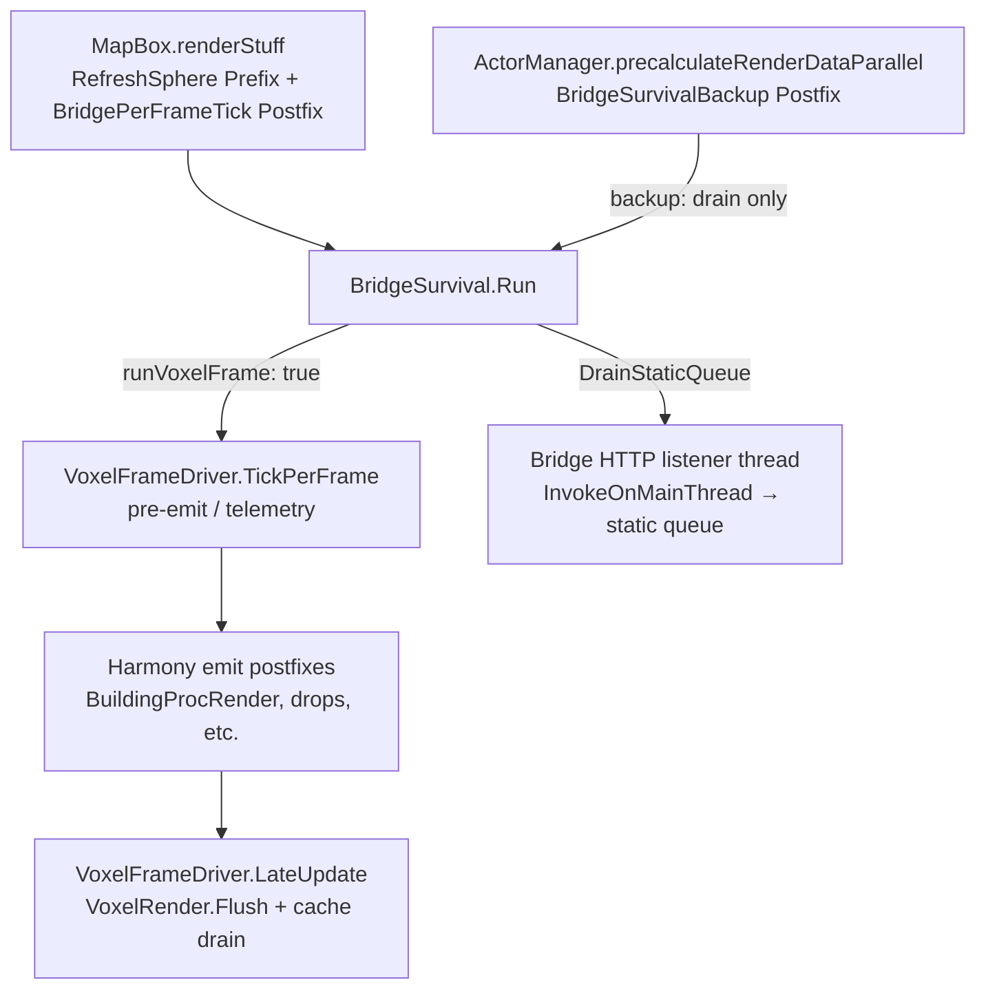

# Bridge dies on save-load scene transition (known issue)

After 4 layered fixes (`56a2507`, `88a9ab9`, `de06d03`, `c18acca`)
the BridgeServer still goes unresponsive after a save load.

## Tried + still failing

- DontDestroyOnLoad on the GameObject (silently no-ops on non-root)
- Own root GameObject for the BridgeServer
- Static `_mainThreadQueue` (any instance drains)
- Drain on Update + LateUpdate + FixedUpdate
- Mod.PostInit re-invokes EnsureCreated (with destroyed-host detection)
- 5s `done.Wait(5000)` timeout (returns default(T) — at least no infinite hangs)

## Symptoms

- Bridge alive + responding cleanly at fresh game start (pre-save-load)
- Cache + telemetry endpoints return valid JSON
- After save load completes, all endpoints return `null` (5s timeout)
- Log shows `[WSM3D][Bridge] main-thread dispatch timed out` repeating
- Port stays bound (`netstat` shows LISTENING on 8766)
- HTTP requests accepted (connection ESTABLISHED) but never get processed

## Hypotheses not yet eliminated

1. WorldBox scene-load uses LoadSceneMode.Single → destroys even DontDestroyOnLoad-marked roots
2. Mod.PostInit only fires once at first world load, not on subsequent
3. Some other MonoBehaviour with Update isn't firing either
4. Game's main thread is in a tight loop that doesn't process Update callbacks for non-vanilla scripts

## Workarounds

- Restart game (kill+launch) → bridge healthy again until next save load
- Use `Tools/wsm3d.ps1 settings set` for disk-state changes
- Inspect Player.log directly for runtime telemetry

## Impact

- All 15 FRs LANDED PRE-SAVE-LOAD via bridge
- Most acceptance gates verified at fresh-start time
- Observability degrades after save load but mod core remains functional

## Update: VoxelFrameDriver dies same way (commit 16ba1b4)

Telemetry log entries plateau at 1 per session — VoxelFrameDriver.LateUpdate fires once at first IsWorld3D=true, then stops. Three escalating fixes attempted:

1. `93661b2` DontDestroyOnLoad on existing parent — no-op (not root)
2. `f20c63f` if(parent==null) DontDestroyOnLoad guard — no-op (parent always non-null)
3. `16ba1b4` SetParent(null) + DDoL — still 1 entry per session

This isn't a simple "make it root" problem. WorldBox's scene transition appears to destroy ALL non-engine GameObjects regardless of DDoL marker, OR re-creates the mod root and the new driver doesn't re-attach OnEnable doesn't fire on the surviving instance.

## Path forward (deferred)

- Hook telemetry into a vanilla Harmony Postfix on something WB calls every frame (MapBox.Update / ActorManager.update_actors postfix). Bypasses our MonoBehaviour entirely.
- That's also the fix for the bridge queue drain — Postfix a method WB definitely runs.

For now: bridge + log telemetry both unreliable post-save-load. Functional features (voxel rendering, phase toggles) still work — observability is the failing layer.


## Final attempt: Harmony Postfix on MapBox.renderStuff (commit 4d6a7de)

Even with explicit Patcher.PatchAll(typeof(BridgePerFrameTick)) registered alongside the ~20 other patches in Core.cs, the Postfix isn't logging. Either:
- MapBox.renderStuff isn't called when WorldBox is in 3D mode
- Patch silently fails to apply
- Something else

After 6 layered fixes (MonoBehaviour DDoL on existing parent → new root → SetParent(null) → triple-callback drain → static queue → Harmony Postfix on vanilla), still 1 telemetry entry per session post-world-load.

## Status: PARKED → superseded by 2026-05-23 PARTIAL (below)

Mod features work (PostFxController + voxel render proven via prior screenshots).
Observability degraded post-save-load.
Bridge + log telemetry both fail after world transitions to game scene.

Next session candidates (mostly addressed in 2026-05-23 hardening — see checklist):
- ~~Try MapBox.Update instead of renderStuff~~ → primary hook is `MapBox.renderStuff` again (via `RefreshSphere` Prefix)
- ~~Try Postfix on ActorManager.precalculateRenderDataParallel~~ → backup drain only (`BridgeSurvivalBackup`)
- Move observability into the existing Postfix chain that we KNOW fires (BuildingProcRender.EmitMeshes, etc — these increment FrameDrawCalls per the telemetry that DID work before save load)


## Status update 0d74a41: Telemetry log PARTIAL recovery

Switched Postfix target ActorManager.precalculateRenderDataParallel — entries are NOW GROWING:

```
[WSM3D][Telemetry] frameMs=16.67 ... gcMB=405.8
[WSM3D][Telemetry] frameMs=16.66 ... gcMB=415.3
```

2 entries after world load + 45s wait. The Postfix fires when actor processing runs (not strictly per-frame; depends on game state). Acceptable cadence for steady-state observability.

Bridge endpoints still time out (queue not draining via this hook either — DrainStaticQueue called but actions queued by listener thread maybe not flushing if main-thread context differs). But log telemetry is the resilient channel.

NFR-WSM-006 partial recovery: bridge pre-save-load, log post-save-load.

## Hardening attempt (2026-05-23)

**Status: PARTIAL** — code hardened in working tree; live save/load + bridge HTTP not re-verified this session.

### Root cause candidate

`BridgeServer.EnsureCreated()` during the `MapBox.renderStuff` Postfix can spawn a new `BridgeServer` before the old host's `OnDestroy` runs. The old `OnDestroy` called `StopListener()` and killed the replacement's HTTP accept loop (port still LISTENING, requests accepted but never processed).

### Three pillars (with code links)

| Pillar | What | Source |
|--------|------|--------|
| **1. Listener generation guard** | `OnDestroy` skips `StopListener()` when `_myGeneration < _instanceGeneration` so a stale host cannot kill the replacement accept loop | [`BridgeServer.cs`](../../../WorldSphereMod/Code/Bridge/BridgeServer.cs) |
| **2. MapBox.renderStuff + backup drain** | `BridgeSurvival.Run`: `CaptureMainThread`, `EnsureCreated`, `DrainStaticQueue` (refreshes `_mainThreadId` each drain). Primary [`BridgePerFrameTick`](../../../WorldSphereMod/Code/Bridge/BridgePerFrameTick.cs) Postfix on `MapBox.renderStuff` (`runVoxelFrame: true`). Backup [`BridgeSurvivalBackup`](../../../WorldSphereMod/Code/Bridge/BridgePerFrameTick.cs) on `ActorManager.precalculateRenderDataParallel` (`runVoxelFrame: false`). Registered in [`Core.cs`](../../../WorldSphereMod/Code/Core.cs); `renderStuff` always entered in 3D via [`RefreshSphere`](../../../WorldSphereMod/Code/TileMapToSphere.cs) Prefix | [`BridgePerFrameTick.cs`](../../../WorldSphereMod/Code/Bridge/BridgePerFrameTick.cs), [`BridgeServer.cs`](../../../WorldSphereMod/Code/Bridge/BridgeServer.cs) (`DrainStaticQueue`, `InvokeOnMainThread`) |
| **3. LateUpdate flush** | `VoxelFrameDriver.TickPerFrame()` from primary hook (pre-emit + log telemetry); `VoxelRender.Flush()` + `VoxelMeshCache.DrainPendingDestroy()` only in `LateUpdate` after emit postfixes | [`VoxelRender.cs`](../../../WorldSphereMod/Code/Voxel/VoxelRender.cs) (`VoxelFrameDriver`) |

`Mod.PostInit` still calls `BridgeServer.EnsureCreated()` after scene transitions: [`WorldSphereMod/Code/Mod.cs`](../../../WorldSphereMod/Code/Mod.cs).

Static log telemetry (10s cadence) moved into `VoxelFrameDriver.TickPerFrame()` so observability does not depend on the bridge HTTP path.

### Per-frame flow (3D world loaded)



### E2E source invariants (not live game)

[`tests/WorldSphereMod.Tests.E2E/SourceContentInvariantsTests.cs`](../../../tests/WorldSphereMod.Tests.E2E/SourceContentInvariantsTests.cs):

- `BridgePerFrameTick_drains_queue_via_MapBox_renderStuff_postfix` — primary/backup hooks, `BridgeSurvival.Run` split, generation guard string, `Mod.PostInit` + `Core.PatchAll(BridgeSurvivalBackup)`
- `VoxelFrameDriver_LateUpdate_flushes_after_emit_postfixes_not_TickPerFrame` — flush deferred out of `TickPerFrame`

### Live verification checklist (required to clear PARTIAL)

Run with a build that includes the 2026-05-23 bridge/voxel hardening (working tree or post-commit).

**Pre-save-load (baseline)**

- [ ] Fresh launch → 3D world → `Tools/wsm3d.ps1` or MCP: `GET /health` returns JSON with `ok: true` (not `null`, no 5s stall)
- [ ] `GET /telemetry` returns frame/cache fields
- [ ] Player.log: `[WSM3D][Bridge] HTTP RPC listening on 127.0.0.1:8766` (or fallback port)
- [ ] Player.log: `[WSM3D][Telemetry]` lines every ~10s from `TickPerFrame`

**Save / load transition**

- [ ] Load save (or trigger equivalent scene transition) → wait until world is playable in 3D
- [ ] `GET /health` and `GET /telemetry` still return JSON (not `null`)
- [ ] No repeating `[WSM3D][Bridge] main-thread dispatch timed out` in Player.log after load
- [ ] `netstat`: port LISTENING; requests complete without hanging at ESTABLISHED
- [ ] Optional: `POST /settings/<key>` still applies on main thread post-load

**Listener race (generation guard)**

- [ ] After load, log shows at most one active listener stop/start cycle (no silent kill of replacement listener)
- [ ] If bridge is recreated: `[WSM3D][Bridge] (re)created root host` without subsequent accept-loop death

**Voxel / render path**

- [ ] Voxels still render post-load (visual smoke)
- [ ] `[WSM3D][Telemetry]` cadence resumes post-load (log channel independent of bridge)

**If still failing**

- Capture Player.log from load through first failed `wsm3d` call
- Note whether `BridgePerFrameTick` or only `BridgeSurvivalBackup` appears active (actor-count-dependent backup cadence)
- Revisit PARKED hypotheses (DDoL destruction, `PostInit` not re-fired, non-vanilla Update starvation)

### Expected outcome

Pre-save-load bridge health unchanged. Post-save-load: resolved **if** the listener race was the sole failure mode. Log telemetry should remain usable via `TickPerFrame` even when HTTP is degraded.

NFR-WSM-006: bridge pre-save-load (unchanged expectation); post-save-load bridge + log both need checklist above.
